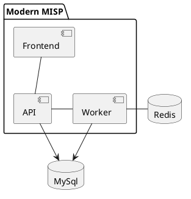

```puml
@startuml

package "Modern MISP" {
  [API]
  [Worker]
  [Frontend]
}
Frontend -- API
API - Worker


database "MySql"
database "Redis"

[API] --> MySql
[Worker] --> MySql
[Worker] - Redis

@enduml
```

<!---
### ::: mmisp.api.config
    options:
      show_source: false
--->

### ::: mmisp.worker.misp_dataclasses.misp_user
### ::: mmisp.worker.main
