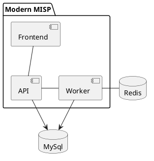

<!---
### ::: mmisp.api.config
    options:
      show_source: false
--->

### ::: mmisp.worker.controller.worker_controller
### ::: mmisp.worker.controller.job_controller
### ::: mmisp.worker.controller.celery_client.celery_client
### ::: mmisp.worker.controller.celery_client.celery_config
### ::: mmisp.worker.config.system_config_data
### ::: mmisp.worker.config.config_data
### ::: mmisp.worker.misp_database.mmisp_redis_config
### ::: mmisp.worker.misp_database.misp_sql_config
### ::: mmisp.worker.misp_database.misp_api_utils
### ::: mmisp.worker.misp_database.misp_api
### ::: mmisp.worker.misp_database.mmisp_redis
### ::: mmisp.worker.misp_database.misp_api_parser
### ::: mmisp.worker.misp_database.misp_sql
### ::: mmisp.worker.misp_database.misp_api_config
### ::: mmisp.worker.api.response_schemas
### ::: mmisp.worker.api.requests_schemas
### ::: mmisp.worker.api.worker_router
### ::: mmisp.worker.api.requests_schemas
### ::: mmisp.worker.api.job_router.job_router
### ::: mmisp.worker.api.api_verification
### ::: mmisp.worker.plugins.loader
### ::: mmisp.worker.plugins.plugin
### ::: mmisp.worker.plugins.factory
### ::: mmisp.worker.jobs.processfreetext.attribute_types.type_validator
### ::: mmisp.worker.jobs.processfreetext.job_data
### ::: mmisp.worker.jobs.processfreetext.processfreetext_config_data
### ::: mmisp.worker.jobs.processfreetext.processfreetext_job
### ::: mmisp.worker.jobs.enrichment.job_data
### ::: mmisp.worker.jobs.enrichment.enrich_attribute_job
### ::: mmisp.worker.jobs.enrichment.enrichment_worker
### ::: mmisp.worker.jobs.enrichment.enrichment_config_data
### ::: mmisp.worker.jobs.enrichment.plugins.enrichment_plugin
### ::: mmisp.worker.jobs.enrichment.plugins.enrichment_plugin_factory
### ::: mmisp.worker.jobs.enrichment.enrich_event_job
### ::: mmisp.worker.jobs.correlation.regenerate_occurrences_job
### ::: mmisp.worker.jobs.correlation.clean_excluded_correlations_job
### ::: mmisp.worker.jobs.correlation.correlate_value_job
### ::: mmisp.worker.jobs.correlation.correlation_plugin_job
### ::: mmisp.worker.jobs.correlation.plugins.correlation_plugin_info
### ::: mmisp.worker.jobs.correlation.plugins.correlation_plugin
### ::: mmisp.worker.jobs.correlation.plugins.correlation_plugin_factory
### ::: mmisp.worker.jobs.correlation.utility
### ::: mmisp.worker.jobs.correlation.job_data
### ::: mmisp.worker.jobs.correlation.correlation_worker
### ::: mmisp.worker.jobs.correlation.correlation_config_data
### ::: mmisp.worker.jobs.correlation.top_correlations_job
### ::: mmisp.worker.jobs.email.alert_email_job
### ::: mmisp.worker.jobs.email.email_worker
### ::: mmisp.worker.jobs.email.contact_email_job
### ::: mmisp.worker.jobs.email.posts_email_job
### ::: mmisp.worker.jobs.email.job_data
### ::: mmisp.worker.jobs.email.utility.smtp_client
### ::: mmisp.worker.jobs.email.utility.email_config_data
### ::: mmisp.worker.jobs.email.utility.utility_email
### ::: mmisp.worker.jobs.sync.sync_helper
### ::: mmisp.worker.jobs.sync.pull.pull_worker
### ::: mmisp.worker.jobs.sync.pull.job_data
### ::: mmisp.worker.jobs.sync.pull.pull_job
### ::: mmisp.worker.jobs.sync.sync_config_data
### ::: mmisp.worker.jobs.sync.push.job_data
### ::: mmisp.worker.jobs.sync.push.push_worker
### ::: mmisp.worker.jobs.sync.push.push_job
### ::: mmisp.worker.misp_dataclasses.misp_event_view
### ::: mmisp.worker.misp_dataclasses.misp_user
### ::: mmisp.worker.misp_dataclasses.misp_tag
### ::: mmisp.worker.misp_dataclasses.misp_sharing_group_org
### ::: mmisp.worker.misp_dataclasses.misp_galaxy_element
### ::: mmisp.worker.misp_dataclasses.misp_galaxy_cluster
### ::: mmisp.worker.misp_dataclasses.misp_event
### ::: mmisp.worker.misp_dataclasses.misp_thread
### ::: mmisp.worker.misp_dataclasses.misp_role
### ::: mmisp.worker.misp_dataclasses.misp_post
### ::: mmisp.worker.misp_dataclasses.misp_server
### ::: mmisp.worker.misp_dataclasses.misp_organisation
### ::: mmisp.worker.misp_dataclasses.misp_sharing_group_server
### ::: mmisp.worker.misp_dataclasses.misp_proposal
### ::: mmisp.worker.misp_dataclasses.misp_event_report
### ::: mmisp.worker.misp_dataclasses.misp_id
### ::: mmisp.worker.misp_dataclasses.misp_object_attribute
### ::: mmisp.worker.misp_dataclasses.misp_event_attribute
### ::: mmisp.worker.misp_dataclasses.misp_sharing_group
### ::: mmisp.worker.misp_dataclasses.misp_correlation
### ::: mmisp.worker.misp_dataclasses.misp_sighting
### ::: mmisp.worker.misp_dataclasses.misp_galaxy
### ::: mmisp.worker.misp_dataclasses.attribute_type
### ::: mmisp.worker.misp_dataclasses.misp_server_version
### ::: mmisp.worker.misp_dataclasses.misp_object
### ::: mmisp.worker.main
### ::: mmisp.worker.exceptions.plugin_exceptions
### ::: mmisp.worker.exceptions.job_exceptions
### ::: mmisp.worker.exceptions.environment_exceptions
### ::: mmisp.worker.exceptions.misp_api_exceptions
### ::: mmisp.worker.exceptions.server_exceptions
